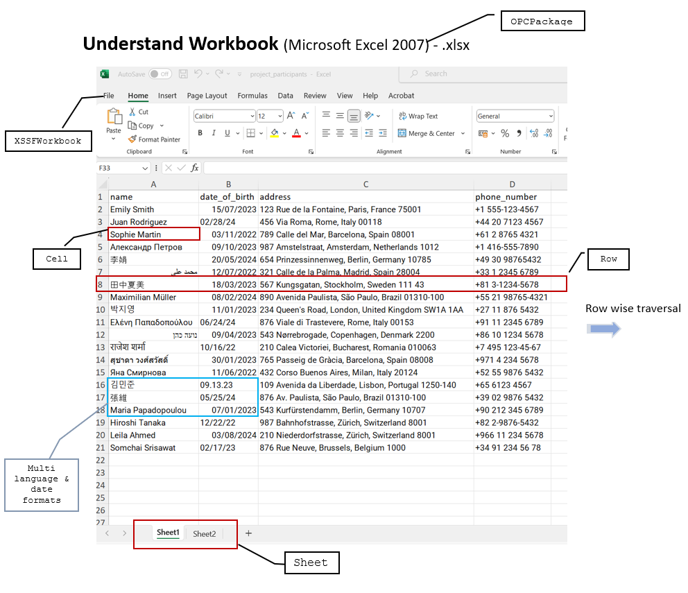

# NRC Excel Reader
This command line application written in Java & build with maven to 
read data from .xlsx file having multiple sheets and sends data to API.

### How to use ?
    Step 1 : Find Application\nrc-excel-data-upload-cliApp.zip folder in the repo
    Step 2 : Unzip file & update the application properties 
    Step 3 : Place excel sheet inside xlsx-Input folder
    Step 4 : Launch batch file - excel_reader_launcher.bat
    Step 5 : Check logs inside /logs/output.txt

### How it works ?
 Let's see some core concepts behind its working . .  
#### Apache POI Library used for reading file as below

#### API Request body accepts a payload of an array of:
    {
    name: string;
    date_of_birth: ISO-8601 string;
    address: string;
    phone_number: string;
    }
#### This CLI Application repo comes with 
    1. Source Code,
    2. executable jar,
    3. sample Windows batch file,
    4. sample ExcelSheet file 
    5. application properties.
please check released_cli folder for more details.

Command Line Application expects JRE & System property parameter (location of properties file) in command 
as shown below when executing from CLI
#### java -Dpath.properties=fullyQualifiedPathOfPropertyFile -jar jarfileName

application.properties file is important to update before executing batch/jar file

#### application.properties looks like below :
#### 
    #Mon Aug 28 17:37:58 SEPT 2023
    api.URI=https://test-api.not.nrc.no/project-participants
    api.NRC-API-KEY=your-nrcapi-key
    xlsx.location=.\\xlsx-Input\\project_participants.xlsx

##### Example of Sheet Data mapped
    {
    "name": "Sophie Martin",
    "date_of_birth": "2022-11-03",
    "address": "789 Calle del Mar, Barcelona, Spain 08001",
    "phone_number": "+61 2 8765 4321"
    },
    {
    "name": "נועה כהן",
    "date_of_birth": "2023-04-09",
    "address": "543 Nørrebrogade, Copenhagen, Denmark 2200",
    "phone_number": "+86 10 1234 5678"
    },
    {
    "name": "राजेश शर्मा",
    "date_of_birth": "2022-10-16",
    "address": "210 Calea Victoriei, Bucharest, Romania 010063",
    "phone_number": "+7 495 123-45-67"
    },
    {
    "name": "สุชาดา วงศ์สวัสดิ์",
    "date_of_birth": "2023-01-30",
    "address": "765 Passeig de Gràcia, Barcelona, Spain 08008",
    "phone_number": "+971 4 234 5678"
    },

##### Resources Used :
https://poi.apache.org/components/spreadsheet/quick-guide.html#ReadWriteWorkbook

#### Note :
    Currently this utility is only supporting to specific format of data provided in the given .xlsx sheet